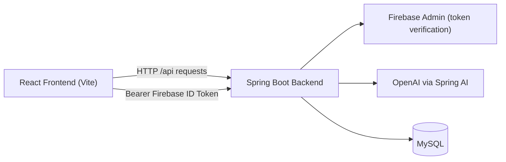

# PomoAI


PomoAI is an AI-assisted learning platform that combines focused study sessions with active-recall quizzes.  
It is designed to help users move from passive reading to measurable retention by turning any topic into a short, structured learning cycle.

## Project Overview

Most study tools track time, but not understanding.  
PomoAI closes that gap by connecting a study timer workflow with AI-generated questions, answer validation, and session analytics.

From a product perspective, this enables:
- Faster topic onboarding (type a topic, start immediately)
- Better recall through question-first interaction patterns
- Visible progress through historical performance metrics

## Tech Stack

### Frontend
- React 19 + TypeScript
- Vite 7
- React Router 7
- Tailwind CSS
- Firebase Web SDK (Google Sign-In)
- Lucide React (icons)

### Backend
- Java 17
- Spring Boot 3.5
- Spring Web, Spring Data JPA, Spring Validation
- Spring Security (stateless token auth)
- Spring AI (OpenAI integration)
- Firebase Admin SDK (ID token verification)
- Springdoc OpenAPI (Swagger UI)

### Data & Infrastructure
- MySQL
- JPA/Hibernate
- Maven Wrapper (`./mvnw`)

## Key Features

- Guest "Speed Learning" mode with AI-generated topic summary and quiz
- Authenticated Pomodoro-style session flow (start -> focus -> quiz -> results)
- Google authentication with Firebase and backend token verification
- Onboarding flow with display name + education level persistence
- Active recall UX: users think before seeing answer options
- Session history and dashboard analytics:
  - Total focus time
  - Accuracy
  - Streak calculation
  - Topic-level performance
- User-configurable study preferences (focus/relax/question count) stored per account
- API-level validation and standardized `ProblemDetail` error responses

## Architecture

### Monorepo Layout
```text
pomo-ai/
├── frontend/   # React + TypeScript + Tailwind app
└── backend/    # Spring Boot API + MySQL + AI integration
```

### Frontend/Backend Communication

- Frontend calls backend REST endpoints under `/api/...`
- Public endpoint:
  - `POST /api/demo/generate` (guest demo)
- Protected endpoints (Bearer token required):
  - `/api/auth/sync`
  - `/api/session/*`
  - `/api/user/*`
- Firebase ID token is sent from frontend; backend verifies it via Firebase Admin in a security filter.
- Session and demo results are persisted to MySQL.



## Demo / Visuals

### 1. PomoSession
https://github.com/user-attachments/assets/42396fee-004d-4b9d-aa44-aab0d878d544

### 2. Dashboard
https://github.com/user-attachments/assets/23b3ed69-d5b2-4dab-bc00-9cd959cec957

### 3. Landing Page (Speed Mode)
https://github.com/user-attachments/assets/00370d5c-535d-48df-a95b-8751ad299ea2

## Getting Started (Quick Start with Docker)

The easiest and recommended way to run the full stack (React Frontend, Spring Boot Backend, and MySQL database) is by using Docker Compose. 

### Prerequisites
- [Docker Desktop](https://www.docker.com/products/docker-desktop) installed and running.

### 1. Clone the repository
```bash
git clone <your-repo-url>
cd pomo-ai
```

### 2. Configure enviroment variables
Create a .env file in the root directory to store your credentials.
Please check the .env.example for examples.

### 3. Run the application
```bash
docker-compose up --build
```

### 4. Access the app
Once the terminal shows that the Spring Boot application has started, you can access:
- Frontend App: http://localhost:5173
- Backend API Docs (Swagger): http://localhost:8080/swagger-ui/index.html

